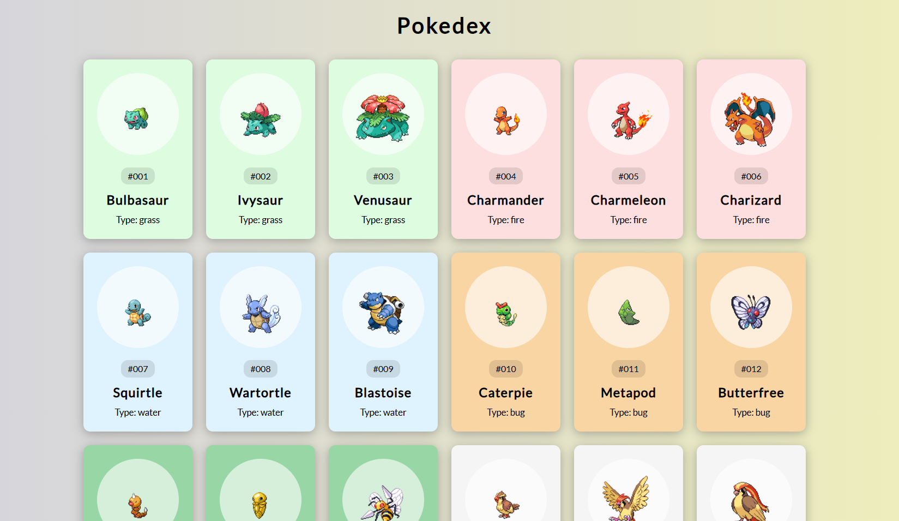

# Pokémon Display Application

A dynamic application that fetches and displays information about Pokémon using the PokeAPI. Each Pokémon is presented with its image, name, ID, and type, with the background color tailored to the Pokémon’s type.



## Features

- **Fetch Pokémon Data**: Retrieve details for the first 150 Pokémon using the PokeAPI.
- **Dynamic Display**: Creates and styles Pokémon cards dynamically based on fetched data.
- **Type-based Coloring**: Background color of each card reflects the Pokémon's type for quick visual identification.
- **Responsive Design**: Ensures a clean and user-friendly interface across different devices and screen sizes.

## Demo

Check out the live demo: [Demo Link](https://mkraj-7838.github.io/pokedex/)

## Installation

To get a local copy up and running, follow these simple steps:

1. **Clone the repo**
    ```sh
    git clone https://github.com/your-username/pokemon-display-app.git
    ```

2. **Navigate to the project directory**
    ```sh
    cd pokemon-display-app
    ```

3. **Open `index.html` in your browser**

## Usage

1. Open the `index.html` file in your preferred web browser.
2. The application will automatically fetch and display the first 150 Pokémon.
3. Scroll through the Pokémon cards to view details such as image, name, ID, and type.

